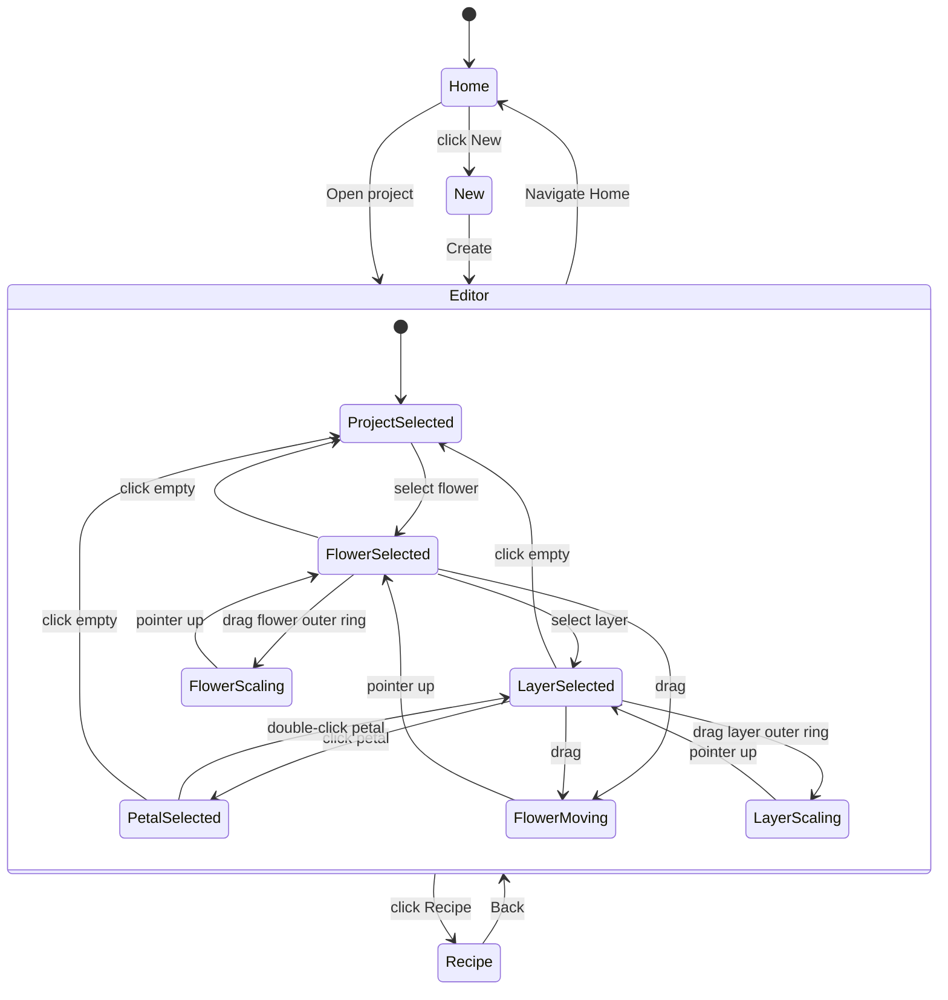

# 01_Flow — ユーザーフロー（状態遷移）

## 1) ナビゲーションフロー

## 2) 選択ルール（重要）
- 空白クリック：選択解除（Project選択へ）
- 花びらダブルクリック：その花びらが属するレイヤーを選択
- Flower/Layer選択中に花びら上でドラッグ：**花びらの選択を変えずに**花全体を移動

## 3) ツリー展開ルール
- Flowerクリック：Flower選択＋展開（expand=true）
- Flowerダブルクリック：展開/折りたたみトグル
- 展開状態は localStorage に保存
